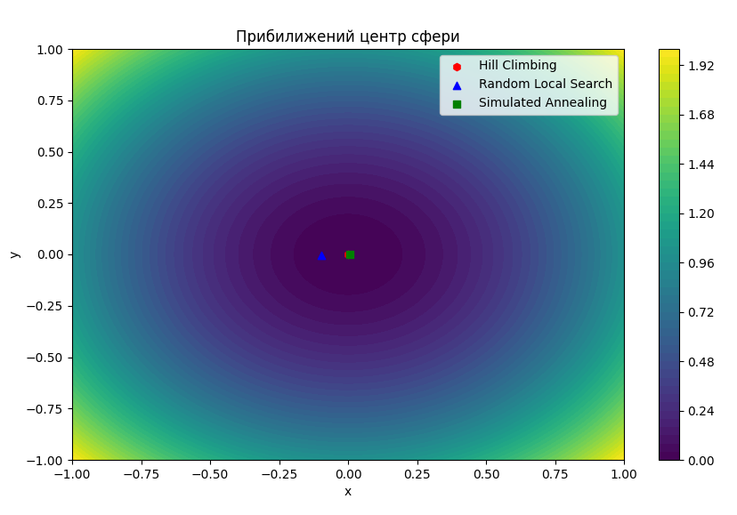

# Optimization Algorithms: Hill Climbing, Random Local Search, Simulated Annealing
This project implements and compares three popular optimization algorithms for minimizing the Sphere Function:

- Hill Climbing
- Random Local Search
- Simulated Annealing

## 📌 Objective Function
The Sphere Function is a standard benchmark in optimization problems:

    f(x, y) = x² + y²

The global minimum is achieved at point (0, 0), where f(x, y) = 0.

## 📦 Project Structure
- main.py — Main script containing algorithm implementations and result visualization.
- README.md — This file.

## 🚀 Run the Project
Run the main.py file using:

    python main.py

## 🧠 Implemented Algorithms
- **Hill Climbing** – Moves step-by-step towards the best neighbor. Stops when no further improvement is possible.
- **Random Local Search** – Randomly samples new points near the current one. Occasionally accepts worse solutions to escape local minima.
- **Simulated Annealing** – Mimics the physical process of annealing. Initially allows worse moves with high probability, gradually reduces the temperature to stabilize near a minimum.

## 📊 Visualization
- matplotlib is used to generate a contour plot showing the search path and solutions found by each algorithm.
- For clarity, the plot zooms in on the approximate center of the sphere within the range [-1, 1] for both axes.

# Results:
- The Sphere Function is a simple yet effective test case for optimization. Its clear global minimum makes it ideal for demonstrating algorithm behavior. The visualization shows how closely each algorithm approaches the global minimum.

- **Hill Climbing:**
    - ~0.000000000000000000000000000002
    - Best result among all.
    - Reached very close to the global minimum (0, 0).
    - Fast and simple.
    - However, if the function had many local minima, it could easily get stuck.
    - Does not make "random" jumps, so it cannot escape plateaus or pits.

- **Random Local Search:**
    - ~0.00927
    - Worst approximation among the three.
    - Random steps did not lead to a very good result in this case.
    - May perform better with more iterations or tuned parameters.
    - More resistant to local minima due to randomness.
    - Results are not always consistent — depends on transition probability and starting point.
    - It can find the global minimum, but doesn’t guarantee it.

- **Simulated Annealing:**
    - ~0.0000325
    - Intermediate performance.
    - Produces good results due to escaping local minima during high "temperature" and gradual cooling toward convergence.
    - Can outperform Hill Climbing with enough runs or proper temperature tuning.
    - Most flexible and robust among the three.
    - Slowly but steadily converges to a near-optimal solution.

## 🏁 Conclusions:
- If speed matters more than flexibility and the function isn't complex — Hill Climbing works great.
- If the function has many local minima or a bad initial guess — Simulated Annealing offers more stable results.
- Random Local Search is simple but less effective unless properly tuned.

## 🔒 Constraints
Each algorithm operates within the domain:
x ∈ [-5, 5], y ∈ [-5, 5]
Points are kept within bounds using a clamp function.

## 🧩 Dependencies
- numpy
- matplotlib

Install them using:

    pip install numpy matplotlib

## 📚 Author
This project was developed as part of GoIT's educational program.